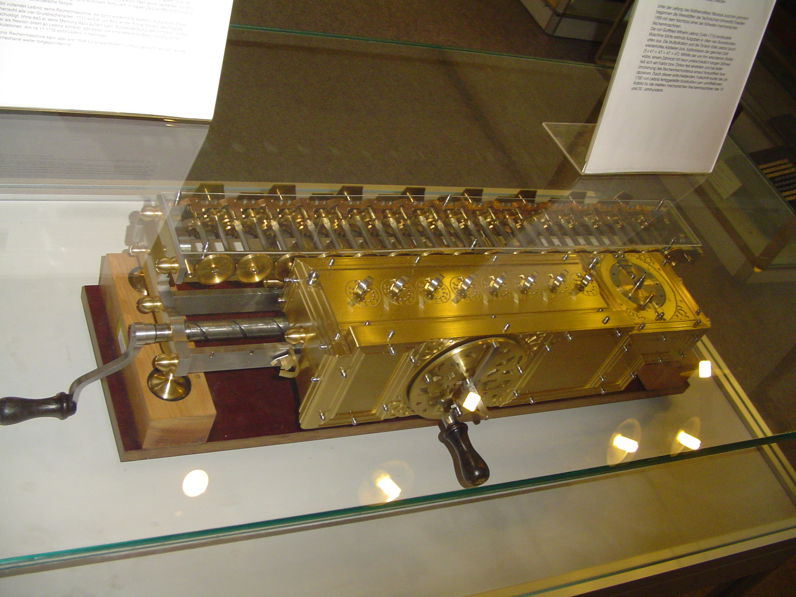

# Before 1st Generation

## Abacus (2700 BC)

- The abacus (plural abaci or abacuses), also called a counting frame, is a calculating tool which has been used since ancient times.
-  It consists of rows of movable beads, or similar objects, strung on a wire. 
- They represent digits. One of the two numbers is set up, and the beads are manipulated to perform an operation such as addition, or even a square or cubic root.

## Pascal’s Calculator (1652)

- Pascal's calculator (also known as the arithmetic machine or Pascaline) is a mechanical calculator invented by Blaise Pascal in 1642. Pascal was led to develop a calculator by the laborious arithmetical calculations required by his father's work as the supervisor of taxes in Rouen.
- He designed the machine to add and subtract two numbers directly and to perform multiplication and division through repeated addition or subtraction.

## Stepped Reckoner (1694)

- The stepped reckoner or Leibniz calculator was a mechanical calculator invented by the German mathematician Gottfried Wilhelm Leibniz around 1672 and completed in 1694.
- The name comes from the translation of the German term for its operating mechanism, Staffelwalze, meaning "stepped drum". 
- It was the first calculator that could perform all four arithmetic operations.
- Its intricate precision gearwork, however, was somewhat beyond the fabrication technology of the time; mechanical problems, in addition to a design flaw in the carry mechanism, prevented the machines from working reliably.

## Arithmometer (1820)

- The arithmometer was the first digital mechanical calculator strong enough and reliable enough to be used daily in an office environment. 
- This calculator could add and subtract two numbers directly and could perform long multiplications and divisions effectively by using a movable accumulator for the result.

## The Difference Engine (14 June 1822)

- Charles Babbage (Father of Computers) began to construct a small difference engine in 1819 and had completed it by 1822 (Difference Engine 0).
- He announced his invention on 14 June 1822, in a paper to the Royal Astronomical Society, entitled "Note on the application of machinery to the computation of astronomical and mathematical tables".
- This machine used the decimal number system and was powered by cranking a handle. 
- The British government was interested, since producing tables was time-consuming and expensive and they hoped the difference engine would make the task more economical.

## Analytical Engine (1834)

- The Analytical Engine was a proposed mechanical general-purpose computer designed by English mathematician and computer pioneer Charles Babbage.
- It was first described in 1837 as the successor to Babbage's difference engine, which was a design for a simpler mechanical calculator.

