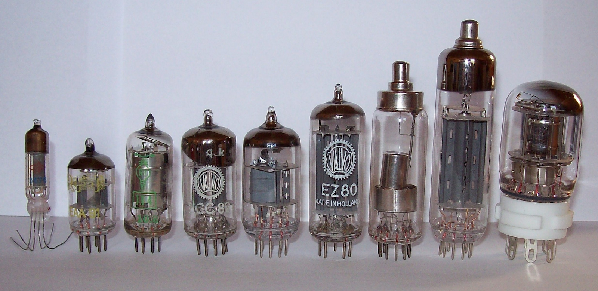

# First Generation Computers (1940-1956)

| Property | Description |
|-|-|
| Main electronic component | Vacuum tube |
| Programming language | Machine language |
| Memory | Magnetic tapes and magnetic drums |
| Input/output devices | Paper tape and punched cards |
| Speed | Very slow |
| Size | very large (often taking up entire room) |
| Examples | <ul><li>IBM 650</li><li>IBM 701</li><li>ENIAC</li><li>UNIVAC1</ul> |

