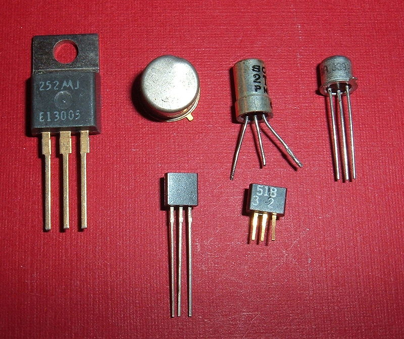

# Second Generation Computers (1956-1963)

| Property | Description |
|-|-|
| Main electronic component | Transistor |
| Programming language | Machine language and assembly language |
| Memory | Magnetic core and magnetic tape/disk |
| Input/output devices | Magnetic tape and punched cards |
| Speed | Slow |
| Size | Smaller in size, low power consumption, and generated less heat |
| Examples | <ul><li>PDP-8<li>IBM1400 series<li>IBM 7090 and 7094<li>UNIVAC 1107<li>CDC 3600</ul> |

