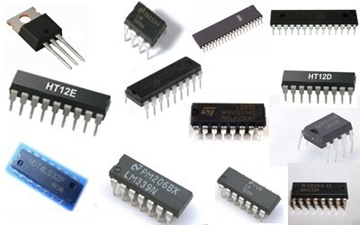

# Third Generation Computers (1964-1971)

| Property | Description |
|-|-|
| Main electronic component | Integrated circuits (ICs) |
| Programming language | High-level language |
| Memory | Magnetic core and magnetic tape/disk |
| Input/output devices | Magnetic tape, monitor, keyboard, printer |
| Speed | faster |
| Size | Smaller |
| Examples | <ul><li>IBM 360<li>IBM 370<li>PDP-11<li>NCR 395<li>B6500<li>UNIVAC 1108</ul> |

