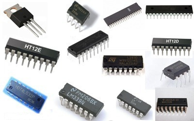

# Fourth Generation Computers (1971 - Present)

| Property | Description |
|-|-|
| Main electronic component | Very large-scale integration (VLSI) and the microprocessor |
| Programming language | High-level language |
| Memory | Semiconductor memory (such as RAM, ROM, etc.) |
| Input/output devices | pointing devices, optical scanning, keyboard, monitor, printer |
| Speed | faster |
| Size | Smaller |
| Examples | <ul><li>IBM PC<li>STAR 1000<li>APPLE II<li>Apple Macintosh<li>Alter 8800</ul> |

