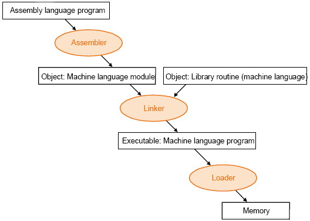
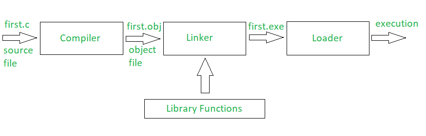
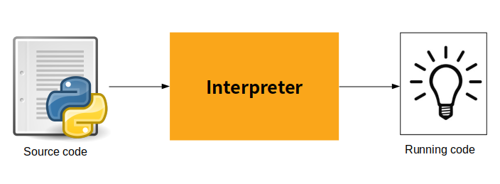

# Coding Basics

## Why write programs if they already made?

- More customizations
- More features
- Unique requirements
- Privacy concerns
- Fun
- New ideas  
etc

## Types of programming languages

### Machine Language (Binary Language/ Binary Code/ Machine Code)
- directly understandable by the system
- it is a sequence of `0`'s and `1`'s
- Example: `01001000 01100101 01101100 01101100 01101111` is binary for `Hello`

### Low-level languages (LLL)
- Faster execution
- System friendly
- User unfriendly
- Eg: Assembly Language, etc

### High-level languages (HLL)
- Slow execution
- User friendly
- System unfriendly
- Eg: C, C++, Java, Python, etc

Also Read: 
- [Why LLL faster than HLL](https://medium.com/@LoopPerfect/why-are-low-level-languages-fast-and-high-level-languages-slow-9034c7e74da8)
- [Difference between LLL and HLL](https://byjus.com/gate/difference-between-high-level-and-low-level-languages/)

## Which language does computer understand?
- computer only understands Binary Code (Machine Language)
- computer understands neither of LLL or HLL

### Why does computer only understands Binary code?
- Being an electronic device, it understands only 2 things (states):
    - `0`: Off
    - `1`: On

## How to make computer understand HLL or LLL?
- Question: If we want to read a book written in an unknown language, what do we need to understand?
    - Answer: An interpreter/ converter

- Similarly, if a computer wants to understand a language unknown to it, we have to first convert it to something that it does understand, i.e, Binary Code.

### Converters
1. Assembler: 
    - converts Assembly language to target language
1. Compiler:
    - converts Source language to target language
    - translates entire source code into target code
    - lists all errors
    - it is not done on runtime
1. Interpreter:
    - converts Source language to target language
    - translates source code into target code line by line
    - stops at 1st error
    - it is done at runtime

See Also:
- [Difference between Compiler and Interpreter](https://www.tutorialspoint.com/what-is-the-difference-between-compiler-and-interpreter)

### Why are Compiler and interpreter for same task?
- Compilers and interpreters both seem to be very similar, but they are unique and powerful in their own ways
- some languages/ technologies use both compiler and interpreter

### Code Execution:
| Converter | Source code to target code flow |
| - | - |
| Assembler |  |
| Compiler |  |
| Interpreter |  |

## Why so many languages (HLLs)?

There are always some shortcomings in a language. New languages tend to reduce the coding effort, make code more robust, improve code style, add features and supports, etc.

Example of languages:  
Binary language, Assembly, B, C, C++, Java, Python, Golang, Javascript, etc.

### Which is the best language to use?

- Every language has some advantages and disadvantages.
- Some languages are easy to write, but slow.
- Some are difficult and lengthy, but fast.
- Some don't support certain requirements. Such as websites are not so machine dependent.

If there would have a best language for all purposes, other languages would have cease to exist.

### How to choose which language to use?

- If client/ employer/ partners specifically asks for certain language
- Requirements fulfilled by that language
- Popularity of the language
- Community of the language
- Ease of writing code
- Speed of execution
- Target users  
etc

## Basic Components of a Software (Application/ App)

| Component | Description |
| - | - |
| Language(s) | The core languages in which the code is written |
| Framework(s) | <ul><li>A framework is a piece of code gives tools to a language to fulfil the task. <li>It contains some extra functions, classes, etc to perform certain work. <li>Frameworks are optional in a project. <li>You can write what u need, if u have sufficient knowledge. <li>Frameworks are written by coders like us who then made their code public for others to use. <li>Just like languages, people try to improve existing frameworks, resulting in new frameworks.</ul> Ex: Spring, Django, Flask, Node.js, etc |
| Platform(s) | Platform in computer refers to:<ul><li> Hardware <li>Operating system <li>Softwares </ul>etc the program depends upon to run |
| Databases | These are the places where we store the app data, user data, management data, etc |
| Test suites | These are required for checking if app is working fine or not |
