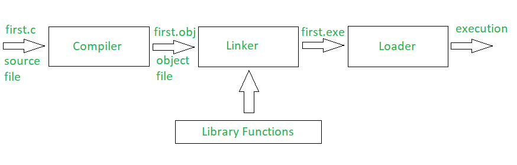

# Software Basics

## Why write programs if they already made?

- More customizations
- More features
- Unique requirements
- Privacy concerns
- Fun
- New ideas  
etc

## Types of programming languages

### Machine Language (Binary Language/ Binary Code/ Machine Code)
- directly understandable by the system
- it is a sequence of `0`'s and `1`'s
- Example: `01001000 01100101 01101100 01101100 01101111` is binary for `Hello`

### Low-level languages (LLL)
- Faster execution
- System friendly
- User unfriendly
- Eg: Assembly Language, etc

### High-level languages (HLL)
- Slow execution
- User friendly
- System unfriendly
- Eg: C, C++, Java, Python, etc

Also Read: 
- [Why LLL faster than HLL](https://medium.com/@LoopPerfect/why-are-low-level-languages-fast-and-high-level-languages-slow-9034c7e74da8)
- [Difference between LLL and HLL](https://byjus.com/gate/difference-between-high-level-and-low-level-languages/)

## Which language does computer understand?
- computer only understands Binary Code (Machine Language)
- computer understands neither of LLL or HLL

### Why does computer only understands Binary code?
- Being an electronic device, it understands only 2 things (states):
    - `0`: Off
    - `1`: On

## How to make computer understand HLL or LLL?
- Question: If we want to read a book written in an unknown language, what do we need to understand?
    - Answer: An interpreter/ converter

- Similarly, if a computer wants to understand a language unknown to it, we have to first convert it to something that it does understand, i.e, Binary Code.

### Converters
1. Assembler: 
    - converts Assembly language to target language
1. Compiler:
    - converts Source language to target language
    - translates entire source code into target code
    - lists all errors
    - it is not done on runtime
1. Interpreter:
    - converts Source language to target language
    - translates source code into target code line by line
    - stops at 1st error
    - it is done at runtime

See Also:
- [Difference between Compiler and Interpreter](https://www.tutorialspoint.com/what-is-the-difference-between-compiler-and-interpreter)

### Why are Compiler and interpreter for same task?
- Compilers and interpreters both seem to be very similar, but they are unique and powerful in their own ways
- some languages/ technologies use both compiler and interpreter

### Code Execution:
- Assembler:  
- Compiler:  
- Interpreter:  
