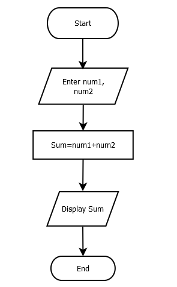
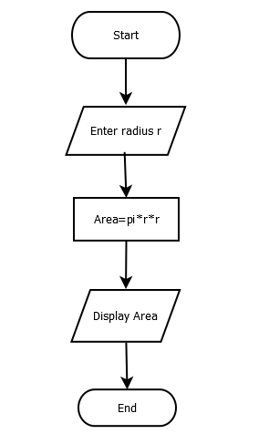
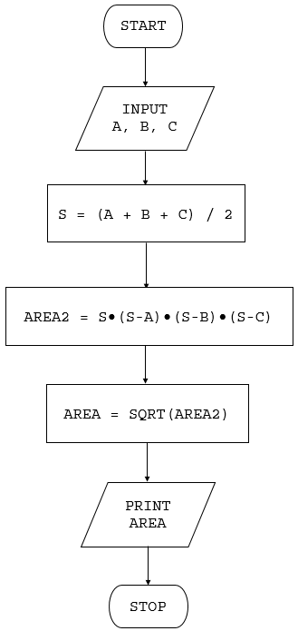
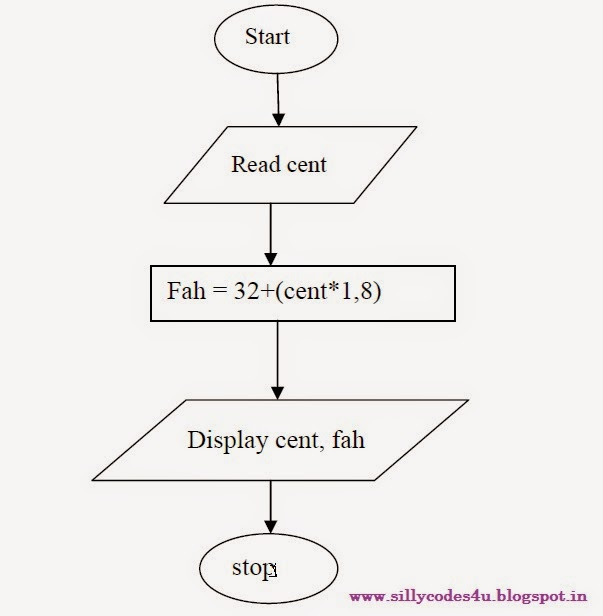

# Simple

## Examples

| Problem | Flowchart |
| - | - |
| Add 2 numbers |  |
| Calculate area of a circle |  |
| Calculate area of a triangle using Hero's formula |  |
| Convert temperature from Celsius to Fahrenheit |  |
