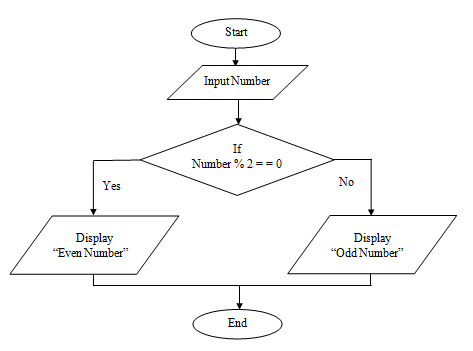
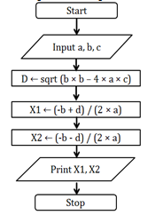

# Conditional

## Syntax

## Examples

| Problem | Flowchart |
| - | - |
| Check if a number is odd or even |  |
| Check if roots of a quadratic equation are imaginary, given the coefficients of the terms |  |
