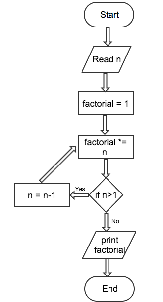
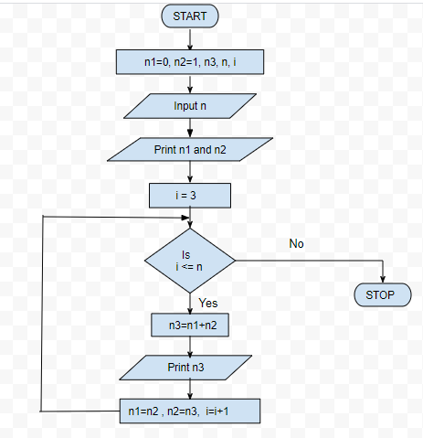
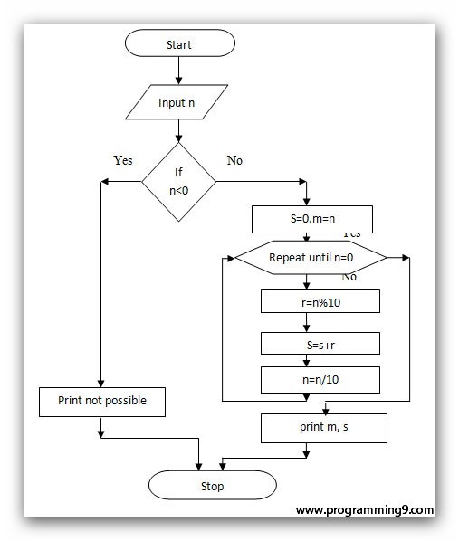
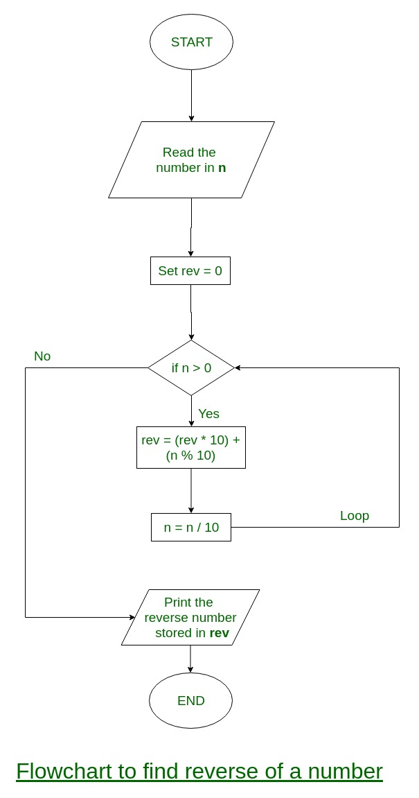

# Loops

## Examples

| Problem | Flowchart |
| - | - |
| Print table of a number |  |
| Calculate factorial of a number |  |
| Print fibonacci series upto N terms |  |
| Print sum of digits of a number |  |
| Print reverse of a number |  |
