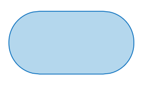

# Flowchart

- It is a diagrammatic representation of an algorithm.
- It helps in visualizing the complexity of an algorithm.

## Symbols

| Symbol | Name | Function |
| - | - | - |
|  | Start/ End | start or end of flowchart |
|  | Input/ Output | input or output values |
|  | Process | processing/ calculation |
|  | decision/ condition | checking a condition/ decision |
|  | connector | indicate continuity of control flow/ execution  |
|  | arrow | shows control flow/ direction of execution |

## Example

## Tools to make flowcharts
- draw.io
